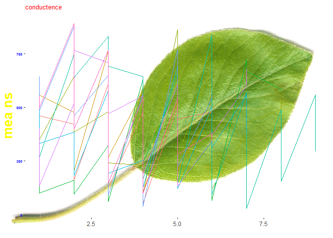
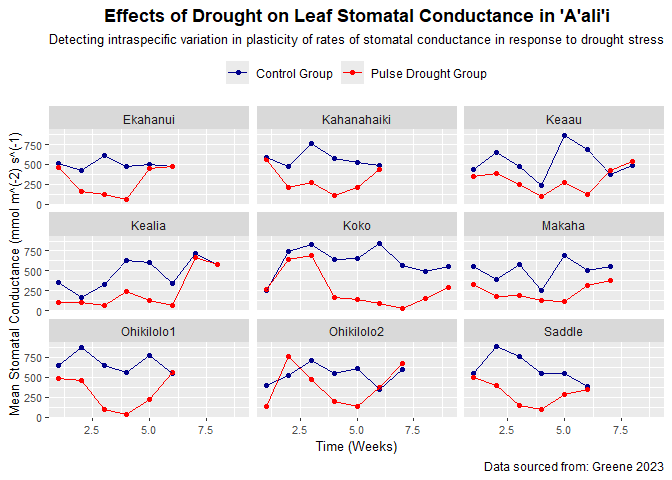

**Good Plot, Bad Plot**
================
Kauanoe Greene
2024-10-28

- [**Libraries**](#libraries)
- [**Data**](#data)
- [**Bad Plot**](#bad-plot)
- [**Good Plot**](#good-plot)

Aloha friends,

Follow along to watch as I attempt to build a Good Plot, Bad Plot! Here,
I try to create both a good and bad plot using the same dataset! This
data set is sourced from my Chapter 1 research investigating the
functional traits driving performance in ’a’ali’i under drought stress.
The plot qualities are based on the standards described in the Wilkes &
Healy’s reading.

# **Libraries**

``` r
# LIBRARIES

library(tidyverse) # for plotting
library(here) # for saving data
library(ggimage) # for plot image background
```

# **Data**

``` r
# DATA UPLOAD
# read in functional trait datasheet
# check out the cleandata sheet

cleandata<-read_csv(here("GoodBadPlot", "Data", "cleandata.csv"))
view(cleandata)
```

Data analyses:

The first step following the data upload is to calculate the means for
all the collected trait data in my spreadsheet, so we can plot it!

We have many options when deciding which functional traits to plot. I
will group my trait data by the control and treatment groups within each
population over time, so we can really see the effects of pulse drought
on plant performance.Plotting the data over time will allows us to
detect patterns of plasticity under stress.

Based on the data mean, I choose to focus on the mean rate of
conductance across control and treatment groups in each population each
week.

``` r
# DATA ANALYSES

# I will calculate the means for all the collected trait data in my spreadsheet.
# I will group my trait data by the control and treatment groups within each population over time.
# Plotting the data over time will allows us to detect patterns of plasticity.
# Based on the data mean, I choose to focus on the mean rate of conductance across control and treatment groups in each population each week.

means <- cleandata %>% 
  group_by(Population, Week, Treatment) %>% 
  summarise(mean.cond = mean(Conductance, na.rm = TRUE), # stomatal conductance
            mean.chl = mean(Chlorophyll, na.rm = TRUE), # chlorophyll content
            mean.alpha = mean(Alpha, na.rm = TRUE), # photosynthetic trait - alpha
            mean.etrm= mean(ETRmax, na.rm = TRUE), # photosynthetic trait - ETR max
            mean.ek = mean(Ek, na.rm = TRUE), # photosynthetic trait - Ek
            mean.npq = mean(NPQmax, na.rm = TRUE), # photosynthetic trait - NPQ max
            mean.fvfm = mean(FvFm, na.rm = TRUE)) # photosynthetic trait - Yield
```

# **Bad Plot**

Let us take our datasheet and put together a plot of poor quality (based
on Wilkes & Healy’s standards, lol).

Bad plot qualities:

- Distracting title and axis text colors
- Format is unorganized and messy  
- Title text size is too small - difficult to read  
- No x-axis label  
- y-axis label text size is not proportional to title text size  
- y-axis label is bold  
- title text is not bold  
- Spelling errors in title text and y-axis label text  
- Distracting plot background image - difficult to read  
- Data points are not clear and are too rigid  
- Absences of units for all plotted data  
- No legend present  
- No major and minor gridlines  
- Overall, this plot does not clearly capture and communicate results!

``` r
# BAD CONDUCTANCE PLOT

badconductanceplot <- means %>% #datasheet
  ggplot(aes(x = Week, # x-axis variable
             y = mean.cond, 
             color = Population)) + # y-axis variable
  geom_line() + # plot as
  labs(, 
       x = "", # x-axis label
       y = "mea ns") + # y-axis label
  ggtitle("conductence") + # plot title
  theme(plot.title = element_text(size = 10, color = "red"), # bold title and color font
        axis.text.y = element_text(size = 5, face = "bold", color = "blue"), axis.title.y = element_text(size = 20, color = "yellow", face = "bold"),   # adjust y-axis labels
        panel.grid.major = element_blank(), 
        panel.grid.minor = element_blank(), 
        panel.border = element_blank(), 
        legend.position = "none")

# upload image for plot background photo
url <- "https://th.bing.com/th/id/R.88a1265ce687180cf3304086de167fa8?rik=8ZXxBDEELVZGxw&riu=http%3a%2f%2fupload.wikimedia.org%2fwikipedia%2fcommons%2f9%2f9d%2fPear_Leaf.jpg&ehk=6oQYxWuB%2bDA0uClCNGOP0zRNFDm6NkyKb53YYJyAnfM%3d&risl=&pid=ImgRaw&r=0"

badconductanceplot <- ggbackground(badconductanceplot, url) # add image to plot

# save plot
ggsave(here("GoodBadPlot", "Output", "badconductanceplot.png")) # save my plot into my output folder!

# view plot
badconductanceplot
```

<!-- -->

# **Good Plot**

- Now, let us take our dataset and create a plot of acceptable quality  
- We will refer to Wilkes & Healy’s standards for guidance

Good plot qualities:

- Captures and communicates data well  
- No spelling errors  
- Units are described for all plotted data  
- Format theme is organized, clear, and clean  
- No distracting colors  
- Scale values are consistent across panels  
- Font size makes text legible  
- Data captions and subtitle add good descriptive detail  
- Data source is cited

``` r
# GOOD CONDUCTANCE PLOT
# Let us create a plot that will communicate our key takeaway
# Main question: how does drought affect the performance of plants across populations, measured via stomatal conductance?
# Key finding: stomatal conductance varies amongst control and drought treatment groups across populations over time.
# Stomatal conductance data was collected on a weekly basis

goodconductanceplot <- means %>% # datasheet
  ggplot(aes(x = Week, # x-axis
             y = mean.cond, # y-axis
             color = Treatment)) + # colors
  geom_point() +  # data points
  geom_line() +  # plot
  labs(subtitle = "Detecting intraspecific variation in plasticity of rates of stomatal conductance in response to drought stress", # plot subtitle
       caption = "Data sourced from: Greene 2023", # plot caption
       x = "Time (Weeks)", # x-axis label
       y = "Mean Stomatal Conductance (mmol m^(-2) s^(-1)") + # y-axis label
  ggtitle("Effects of Drought on Leaf Stomatal Conductance in 'A'ali'i") + # plot title
  facet_wrap(~Population) + # create panels for each population!
  scale_color_manual(breaks= c("C", "PD"), labels = c("Control Group", "Pulse Drought Group"), values = c("darkblue", "red")) + # rename legend variables
  theme(plot.title = element_text(face = "bold", color = "black", hjust = 0.5), # bold title
        axis.text.x = element_text(size = 8), axis.title.x = element_text(size = 10), # adjust x-axis labels
        axis.text.y = element_text(size = 8), axis.title.y = element_text(size = 10),   # adjust y-axis labels
        legend.position = "top", 
        plot.subtitle = element_text(size = 10, hjust = 0.5), 
        legend.title = element_blank())

# save plot to my output folder
ggsave(here("GoodBadPlot", "Output", "goodconductanceplot.png")) 

# view plot
goodconductanceplot
```

<!-- -->

Tada!

Now, we finally have our Good Plot, Bad Plots completed!

Thanks for following along!
