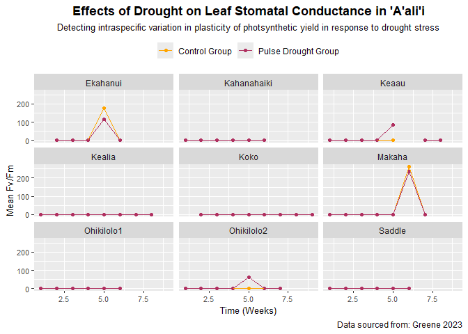
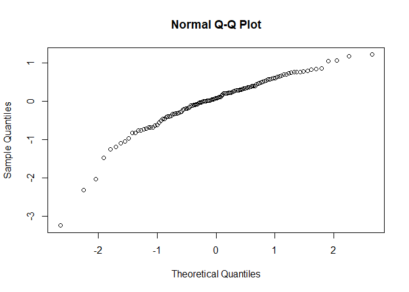

fitness traits!
================
Kauanoe Greene
2024-11-05

# Libraries

``` r
# LIBRARIES

# visuals
library(tidyverse)
library(tidytext)
library(here)

# models (stats)
library(lmerTest)
library (RLRsim)
library(Matrix)
# library(lme4)
library(lattice)
library(car)
library(nlme)
```

# Data Upload

``` r
fitness <- read_csv(here("Project", "Data", "fitnessharvest_master.csv"))

view(fitness)
```

# Biomass

``` r
# revised syntax for primary interaction

# Biomass2 = lmer(logbiomass~ Treatment + (1|Population) + (1|Population:Treatment), data=Kauanoe.drought.fitness, na.action = na.omit)


mod.biomassA = lmer(Total ~ Treatment + (1|Population) + (1|Population:Treatment), data = fitness, na.action = na.omit)
Anova(mod.biomassA, test.statistic="F", type=3) #F-statistic: 15.593  (Drought column) **
```

    ## Analysis of Deviance Table (Type III Wald F tests with Kenward-Roger df)
    ## 
    ## Response: Total
    ##                  F Df Df.res    Pr(>F)    
    ## (Intercept) 50.077  1 13.349 7.206e-06 ***
    ## Treatment   15.593  1  8.006  0.004237 ** 
    ## ---
    ## Signif. codes:  0 '***' 0.001 '**' 0.01 '*' 0.05 '.' 0.1 ' ' 1

``` r
# Analysis of Deviance Table (Type III Wald F tests with Kenward-Roger df)
# Response: Total
                 # F Df Df.res    Pr(>F)    
# (Intercept) 50.077  1 13.349 7.206e-06 ***
# Treatment   15.593  1  8.006  0.004237 ** 
# Signif. codes:  0 ‘***’ 0.001 ‘**’ 0.01 ‘*’ 0.05 ‘.’ 0.1 ‘ ’ 1
```

``` r
#checking normality of residuals in untransformed data

shapiro.test(resid(mod.biomassA)) #p-value: 7.827e-06
```

    ## 
    ##  Shapiro-Wilk normality test
    ## 
    ## data:  resid(mod.biomassA)
    ## W = 0.93074, p-value = 7.827e-06

``` r
qqnorm(resid(mod.biomassA)) #untransofrmed data
```

<!-- -->

``` r
logbiomass<-log(fitness$Total) #log-transformed data
```

``` r
#checking normality of residuals in transformed data

mod.biomassB = lmer(logbiomass ~ Treatment + (1|Population) + (1|Population:Treatment), data = fitness, na.action = na.omit)
Anova(mod.biomassB, test.statistic = "F", type=3) #F-statistic: 35.6707
```

    ## Analysis of Deviance Table (Type III Wald F tests with Kenward-Roger df)
    ## 
    ## Response: logbiomass
    ##                   F Df Df.res    Pr(>F)    
    ## (Intercept)  4.6379  1 13.369 0.0500684 .  
    ## Treatment   35.6707  1  7.991 0.0003349 ***
    ## ---
    ## Signif. codes:  0 '***' 0.001 '**' 0.01 '*' 0.05 '.' 0.1 ' ' 1

``` r
# Analysis of Deviance Table (Type III Wald F tests with Kenward-Roger df)
# Response: logbiomass
                  # F Df Df.res    Pr(>F)    
# (Intercept)  4.6379  1 13.369 0.0500684 .  
# Treatment   35.6707  1  7.991 0.0003349 ***
# Signif. codes:  0 ‘***’ 0.001 ‘**’ 0.01 ‘*’ 0.05 ‘.’ 0.1 ‘ ’ 1
```

``` r
shapiro.test(resid(mod.biomassB)) #p-value: 4.242e-07
```

    ## 
    ##  Shapiro-Wilk normality test
    ## 
    ## data:  resid(mod.biomassB)
    ## W = 0.90933, p-value = 4.242e-07

``` r
qqnorm(resid(mod.biomassB))
```

<!-- -->

``` r
#Overall impression: untransformed data looks better.
```

# Reduced

``` r
# population reduced

mod.biomass.pop = lmer(Total~Treatment+ (1|Population), data = fitness)
Anova(mod.biomass.pop)
```

    ## Analysis of Deviance Table (Type II Wald chisquare tests)
    ## 
    ## Response: Total
    ##            Chisq Df Pr(>Chisq)    
    ## Treatment 63.574  1  1.544e-15 ***
    ## ---
    ## Signif. codes:  0 '***' 0.001 '**' 0.01 '*' 0.05 '.' 0.1 ' ' 1

``` r
# treatment reduced

mod.biomass.dr = glm(Total ~ Treatment, data = fitness)
Anova(mod.biomass.dr)
```

    ## Analysis of Deviance Table (Type II tests)
    ## 
    ## Response: Total
    ##           LR Chisq Df Pr(>Chisq)    
    ## Treatment   46.166  1  1.087e-11 ***
    ## ---
    ## Signif. codes:  0 '***' 0.001 '**' 0.01 '*' 0.05 '.' 0.1 ' ' 1

# Comparison

``` r
# reduced primary interaction x population comparison

anova(mod.biomassA, mod.biomass.pop) #chisq: 2.8836 (P X D column)
```

    ## Data: fitness
    ## Models:
    ## mod.biomass.pop: Total ~ Treatment + (1 | Population)
    ## mod.biomassA: Total ~ Treatment + (1 | Population) + (1 | Population:Treatment)
    ##                 npar    AIC    BIC  logLik deviance  Chisq Df Pr(>Chisq)  
    ## mod.biomass.pop    4 408.90 420.18 -200.45   400.90                       
    ## mod.biomassA       5 408.01 422.12 -199.01   398.01 2.8836  1    0.08948 .
    ## ---
    ## Signif. codes:  0 '***' 0.001 '**' 0.01 '*' 0.05 '.' 0.1 ' ' 1

``` r
# Data: fitness
# Models:
# mod.biomass.pop: Total ~ Treatment + (1 | Population)
# mod.biomassA: Total ~ Treatment + (1 | Population) + (1 | Population:Treatment)
                # npar    AIC    BIC  logLik deviance  Chisq Df Pr(>Chisq)  
# mod.biomass.pop    4 408.90 420.18 -200.45   400.90                       
# mod.biomassA       5 408.01 422.12 -199.01   398.01 2.8836  1    0.08948 .
# Signif. codes:  0 ‘***’ 0.001 ‘**’ 0.01 ‘*’ 0.05 ‘.’ 0.1 ‘ ’ 1
```

``` r
# reduced population x treatment

exactLRT(mod.biomass.pop, mod.biomass.dr) #LRT = 39.807, p-value < 2.2e-16 (Pop column) ***
```

    ## 
    ##  simulated finite sample distribution of LRT. (p-value based on 10000
    ##  simulated values)
    ## 
    ## data:  
    ## LRT = 39.807, p-value < 2.2e-16
