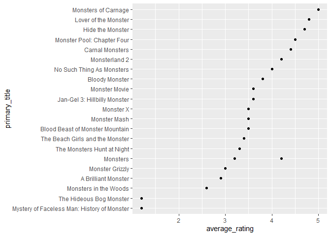
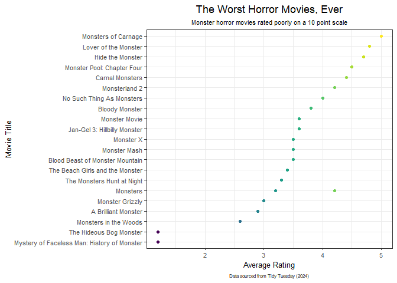

Tidy Tuesday!
================
Kauanoe Greene
2024-11-05

- [Libraries](#libraries)
- [Data Upload](#data-upload)
- [Data Analyses](#data-analyses)
- [Plot](#plot)
- [Takeaways from this assignment](#takeaways-from-this-assignment)

# Libraries

``` r
library(tidyverse)
library(tidytext)
library(here)
library(viridis)
```

# Data Upload

``` r
# read in data from github
# view it

monster_movie_genres <- readr::read_csv('https://raw.githubusercontent.com/rfordatascience/tidytuesday/master/data/2024/2024-10-29/monster_movie_genres.csv')

glimpse(monster_movie_genres)
```

    ## Rows: 1,291
    ## Columns: 2
    ## $ tconst <chr> "tt0016123", "tt0016123", "tt0016123", "tt0023236", "tt0023236"…
    ## $ genres <chr> "Comedy", "Horror", "Mystery", "Horror", "Mystery", "Crime", "D…

``` r
# read in data from github
# view it

monster_movies <- readr::read_csv('https://raw.githubusercontent.com/rfordatascience/tidytuesday/master/data/2024/2024-10-29/monster_movies.csv')

glimpse(monster_movies)
```

    ## Rows: 630
    ## Columns: 10
    ## $ tconst          <chr> "tt0016123", "tt0023236", "tt0031208", "tt0033879", "t…
    ## $ title_type      <chr> "movie", "movie", "movie", "movie", "movie", "movie", …
    ## $ primary_title   <chr> "The Monster", "The Monster Walks", "The Human Monster…
    ## $ original_title  <chr> "The Monster", "The Monster Walks", "The Dark Eyes of …
    ## $ year            <dbl> 1925, 1932, 1939, 1941, 1941, 1942, 1942, 1942, 1944, …
    ## $ runtime_minutes <dbl> 86, 57, 73, 59, 65, 77, 73, 63, 86, 62, 61, 295, 201, …
    ## $ genres          <chr> "Comedy,Horror,Mystery", "Horror,Mystery", "Crime,Dram…
    ## $ simple_title    <chr> "the monster", "the monster walks", "the human monster…
    ## $ average_rating  <dbl> 6.2, 4.1, 5.7, 6.1, 6.0, 3.5, 6.1, 6.1, 5.7, 4.8, 4.9,…
    ## $ num_votes       <dbl> 1412, 1120, 1579, 1953, 799, 1969, 1938, 1588, 504, 12…

# Data Analyses

``` r
# join data sets by tconst using inner_join function.

monsterdata <- inner_join(monster_movie_genres, monster_movies)
view(monsterdata)
glimpse(monsterdata)
```

    ## Rows: 221
    ## Columns: 10
    ## $ tconst          <chr> "tt0051935", "tt0057155", "tt0057323", "tt0058377", "t…
    ## $ genres          <chr> "Sci-Fi", "Horror", "Comedy", "Horror", "Horror", "Sci…
    ## $ title_type      <chr> "movie", "movie", "movie", "movie", "movie", "tvMovie"…
    ## $ primary_title   <chr> "Missile Monsters", "The Blancheville Monster", "The M…
    ## $ original_title  <chr> "Missile Monsters", "Horror", "I mostri", "Il mostro d…
    ## $ year            <dbl> 1958, 1963, 1963, 1964, 1965, 1966, 1971, 1975, 1980, …
    ## $ runtime_minutes <dbl> 75, 88, 87, 84, 70, 100, 75, 86, 105, 100, 95, 50, 102…
    ## $ simple_title    <chr> "missile monsters", "the blancheville monster", "the m…
    ## $ average_rating  <dbl> 4.6, 5.4, 7.4, 5.3, 3.4, 3.6, 5.7, 6.4, 5.2, 6.3, 5.9,…
    ## $ num_votes       <dbl> 46, 888, 2821, 257, 1135, 16, 2041, 312, 83, 177, 79, …

``` r
# group data by genre, title, and ratings

rating_genre <- monsterdata %>% 
  select(genres, primary_title, average_rating) %>% 
  group_by(genres, average_rating) %>% 
  drop_na() %>% 
  filter(average_rating <= "5") %>% 
  filter(genres == "Horror") %>% 
  mutate(primary_title = fct_lump(primary_title))

glimpse(rating_genre)
```

    ## Rows: 22
    ## Columns: 3
    ## Groups: genres, average_rating [17]
    ## $ genres         <chr> "Horror", "Horror", "Horror", "Horror", "Horror", "Horr…
    ## $ primary_title  <fct> The Beach Girls and the Monster, Blood Beast of Monster…
    ## $ average_rating <dbl> 3.4, 3.5, 3.6, 4.8, 4.5, 3.3, 3.6, 4.4, 1.2, 2.6, 3.0, …

# Plot

``` r
# plot data

badhorrorplot <- rating_genre %>% # datasheet
  ggplot(aes(x = average_rating, # x-axis
             y = primary_title)) + # colors
  geom_point() # data point # plot
  
badhorrorplot  
```

<!-- -->

``` r
# add labels

horrorplot <- rating_genre %>% # datasheet
  ggplot(aes(x = average_rating, # x-axis
             y = primary_title, 
             color = average_rating)) + # colors
  geom_point() +  # data point # plot
  labs(title = "The Worst Horror Movies, Ever", 
       x = "Average Rating", 
       y = "Movie Title", 
       caption = "Data sourced from Tidy Tuesday (2024)", 
       subtitle = "Monster horror movies rated poorly on a 10 point scale") + 
  theme_bw() + 
  theme(legend.position = "none", 
        plot.title = element_text(hjust = 0.5), # bold title
        axis.text.x = element_text(size = 8), axis.title.x = element_text(size = 10), # adjust x-axis labels
        axis.text.y = element_text(size = 8), axis.title.y = element_text(size = 10),   # adjust y-axis labels
        plot.caption = element_text(size = 6, hjust = 0.5),
        plot.subtitle = element_text(size = 8, hjust = 0.5)) + 
          scale_color_viridis()
  

horrorplot
```

<!-- -->

``` r
# save plot to my output folder
ggsave(here("Tidy_Tuesday", "Output", "horrorplot.png")) 

# save csv file to data folder
write.csv(rating_genre, here("Tidy_Tuesday", "Data", "rating_genre.csv"))
```

# Takeaways from this assignment

- I read in the CSV file directly from GitHub, for the first time.  
- I practiced more data organization, which I never feel super confident
  with.  
- I practiced with factors, a bit, and got the x-axis sorted in
  numerical order.
