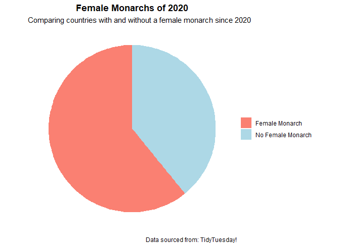

Tidy Tuesday!
================
Kauanoe Greene
2024-11-11

- [Libraries](#libraries)
- [Data Upload](#data-upload)
- [Data Analyses](#data-analyses)
- [Plot](#plot)
- [Tidy Tuesday Wrap-up!](#tidy-tuesday-wrap-up)

# Libraries

``` r
# Packages

# install.packages("tidytuesdayR")

# Libraries

library(tidyverse)
library(tidytext)
library(here)
```

# Data Upload

``` r
# Dataset: Democracy and Dictatorship

democracy_data <- readr::read_csv('https://raw.githubusercontent.com/rfordatascience/tidytuesday/master/data/2024/2024-11-05/democracy_data.csv') # data upload straight from github!

glimpse(democracy_data) # check out the data
```

    ## Rows: 14,768
    ## Columns: 43
    ## $ country_name                <chr> "Afghanistan", "Afghanistan", "Afghanistan…
    ## $ country_code                <chr> "AFG", "AFG", "AFG", "AFG", "AFG", "AFG", …
    ## $ year                        <dbl> 1950, 1951, 1952, 1953, 1954, 1955, 1956, …
    ## $ regime_category_index       <dbl> 5, 5, 5, 5, 5, 5, 5, 5, 5, 5, 5, 5, 5, 5, …
    ## $ regime_category             <chr> "Royal dictatorship", "Royal dictatorship"…
    ## $ is_monarchy                 <lgl> TRUE, TRUE, TRUE, TRUE, TRUE, TRUE, TRUE, …
    ## $ is_commonwealth             <lgl> FALSE, FALSE, FALSE, FALSE, FALSE, FALSE, …
    ## $ monarch_name                <chr> "Mohammed Zahir Shah", "Mohammed Zahir Sha…
    ## $ monarch_accession_year      <dbl> 1933, 1933, 1933, 1933, 1933, 1933, 1933, …
    ## $ monarch_birthyear           <dbl> 1914, 1914, 1914, 1914, 1914, 1914, 1914, …
    ## $ is_female_monarch           <lgl> FALSE, FALSE, FALSE, FALSE, FALSE, FALSE, …
    ## $ is_democracy                <lgl> FALSE, FALSE, FALSE, FALSE, FALSE, FALSE, …
    ## $ is_presidential             <lgl> FALSE, FALSE, FALSE, FALSE, FALSE, FALSE, …
    ## $ president_name              <chr> NA, NA, NA, NA, NA, NA, NA, NA, NA, NA, NA…
    ## $ president_accesion_year     <dbl> NA, NA, NA, NA, NA, NA, NA, NA, NA, NA, NA…
    ## $ president_birthyear         <dbl> NA, NA, NA, NA, NA, NA, NA, NA, NA, NA, NA…
    ## $ is_interim_phase            <lgl> NA, NA, NA, NA, NA, NA, NA, NA, NA, NA, NA…
    ## $ is_female_president         <lgl> NA, NA, NA, NA, NA, NA, NA, NA, NA, NA, NA…
    ## $ is_colony                   <lgl> FALSE, FALSE, FALSE, FALSE, FALSE, FALSE, …
    ## $ colony_of                   <chr> NA, NA, NA, NA, NA, NA, NA, NA, NA, NA, NA…
    ## $ colony_administrated_by     <chr> NA, NA, NA, NA, NA, NA, NA, NA, NA, NA, NA…
    ## $ is_communist                <lgl> FALSE, FALSE, FALSE, FALSE, FALSE, FALSE, …
    ## $ has_regime_change_lag       <lgl> FALSE, FALSE, FALSE, FALSE, FALSE, FALSE, …
    ## $ spatial_democracy           <dbl> 0.00, 0.00, 0.25, 0.25, 0.25, 0.25, 0.25, …
    ## $ parliament_chambers         <dbl> 2, 2, 2, 2, 2, 2, 2, 2, 2, 2, 2, 2, 2, 2, …
    ## $ has_proportional_voting     <lgl> FALSE, FALSE, FALSE, FALSE, NA, NA, NA, NA…
    ## $ election_system             <chr> NA, NA, NA, NA, NA, NA, NA, NA, NA, NA, NA…
    ## $ lower_house_members         <dbl> 171, 171, 171, 171, NA, NA, NA, NA, NA, NA…
    ## $ upper_house_members         <dbl> NA, NA, NA, NA, NA, NA, NA, NA, NA, NA, NA…
    ## $ third_house_members         <dbl> NA, NA, NA, NA, NA, NA, NA, NA, NA, NA, NA…
    ## $ has_new_constitution        <lgl> FALSE, FALSE, FALSE, FALSE, FALSE, FALSE, …
    ## $ has_full_suffrage           <lgl> FALSE, FALSE, FALSE, FALSE, FALSE, FALSE, …
    ## $ suffrage_restriction        <chr> "Male vote only", "Male vote only", "Male …
    ## $ electoral_category_index    <dbl> 2, 2, 2, 2, 2, 2, 2, 2, 2, 2, 2, 2, 2, 2, …
    ## $ electoral_category          <chr> "non-democratic multi-party elections", "n…
    ## $ spatial_electoral           <dbl> 1.50, 1.50, 1.75, 1.75, 1.75, 1.75, 1.75, …
    ## $ has_alternation             <lgl> FALSE, FALSE, FALSE, FALSE, FALSE, FALSE, …
    ## $ is_multiparty               <lgl> TRUE, TRUE, TRUE, TRUE, TRUE, TRUE, TRUE, …
    ## $ has_free_and_fair_election  <lgl> FALSE, FALSE, FALSE, FALSE, FALSE, FALSE, …
    ## $ parliamentary_election_year <dbl> 0, 0, 1, 0, 0, 1, 0, 0, 1, 0, 0, 1, 0, 0, …
    ## $ election_month              <chr> NA, NA, "February", NA, NA, NA, NA, NA, NA…
    ## $ election_year               <dbl> NA, NA, 1952, NA, NA, NA, NA, NA, NA, NA, …
    ## $ has_postponed_election      <lgl> FALSE, FALSE, FALSE, FALSE, FALSE, FALSE, …

# Data Analyses

``` r
# this is a huge dataset! let's filter it down.  
# filter year >= 2020  

year <- democracy_data %>% # data set of choice
  filter(year >= "2020") # we want to only see the entries from 2020 and beyond.

glimpse(year) # check it out
```

    ## Rows: 208
    ## Columns: 43
    ## $ country_name                <chr> "Afghanistan", "Albania", "Algeria", "Ango…
    ## $ country_code                <chr> "AFG", "ALB", "DZA", "AGO", "AIA", "ATG", …
    ## $ year                        <dbl> 2020, 2020, 2020, 2020, 2020, 2020, 2020, …
    ## $ regime_category_index       <dbl> 3, 0, 3, 3, NA, 0, 2, 1, NA, 0, 1, 3, 0, 5…
    ## $ regime_category             <chr> "Civilian dictatorship", "Parliamentary de…
    ## $ is_monarchy                 <lgl> FALSE, FALSE, FALSE, FALSE, TRUE, TRUE, FA…
    ## $ is_commonwealth             <lgl> FALSE, FALSE, FALSE, FALSE, FALSE, TRUE, F…
    ## $ monarch_name                <chr> NA, NA, NA, NA, "Elizabeth II", NA, NA, NA…
    ## $ monarch_accession_year      <dbl> NA, NA, NA, NA, 1952, NA, NA, NA, 2013, NA…
    ## $ monarch_birthyear           <dbl> NA, NA, NA, NA, 1926, NA, NA, NA, 1967, NA…
    ## $ is_female_monarch           <lgl> NA, NA, NA, NA, TRUE, NA, NA, NA, FALSE, N…
    ## $ is_democracy                <lgl> FALSE, TRUE, FALSE, FALSE, TRUE, TRUE, TRU…
    ## $ is_presidential             <lgl> TRUE, FALSE, TRUE, TRUE, FALSE, FALSE, TRU…
    ## $ president_name              <chr> "Ashraf Ghani", "Ilir Meta", "Abdelmadjid …
    ## $ president_accesion_year     <dbl> 2014, 2017, 2019, 2017, NA, NA, 2019, 2018…
    ## $ president_birthyear         <dbl> 1949, 1969, 1945, 1954, NA, NA, 1959, 1953…
    ## $ is_interim_phase            <lgl> FALSE, FALSE, FALSE, FALSE, NA, NA, FALSE,…
    ## $ is_female_president         <lgl> FALSE, FALSE, FALSE, FALSE, NA, NA, FALSE,…
    ## $ is_colony                   <lgl> FALSE, FALSE, FALSE, FALSE, TRUE, FALSE, F…
    ## $ colony_of                   <chr> NA, NA, NA, NA, "United Kingdom", NA, NA, …
    ## $ colony_administrated_by     <chr> NA, NA, NA, NA, "Self-governing", NA, NA, …
    ## $ is_communist                <lgl> FALSE, FALSE, FALSE, FALSE, FALSE, FALSE, …
    ## $ has_regime_change_lag       <lgl> FALSE, FALSE, FALSE, FALSE, FALSE, FALSE, …
    ## $ spatial_democracy           <dbl> 0.2500000, 0.8000000, 0.5000000, 0.2500000…
    ## $ parliament_chambers         <dbl> 2, 1, 2, 1, 1, 2, 2, 1, 1, 2, 2, 1, NA, 2,…
    ## $ has_proportional_voting     <lgl> FALSE, TRUE, TRUE, TRUE, FALSE, FALSE, TRU…
    ## $ election_system             <chr> "SNTV", "d'Hondt", "PR Hare quota", "d'Hon…
    ## $ lower_house_members         <dbl> 249, 140, 462, 220, 11, 19, 257, 131, 21, …
    ## $ upper_house_members         <dbl> 102, NA, 144, NA, NA, 17, 72, NA, NA, 76, …
    ## $ third_house_members         <dbl> NA, NA, NA, NA, NA, NA, NA, NA, NA, NA, NA…
    ## $ has_new_constitution        <lgl> FALSE, FALSE, FALSE, FALSE, FALSE, FALSE, …
    ## $ has_full_suffrage           <lgl> TRUE, TRUE, TRUE, TRUE, TRUE, TRUE, TRUE, …
    ## $ suffrage_restriction        <chr> NA, NA, NA, NA, NA, NA, NA, NA, NA, NA, NA…
    ## $ electoral_category_index    <dbl> 2, 3, 2, 2, 3, 3, 3, 3, 3, 3, 3, 2, 3, 2, …
    ## $ electoral_category          <chr> "non-democratic multi-party elections", "d…
    ## $ spatial_electoral           <dbl> 2.000000, 2.800000, 2.500000, 2.250000, 3.…
    ## $ has_alternation             <lgl> FALSE, TRUE, FALSE, FALSE, TRUE, TRUE, TRU…
    ## $ is_multiparty               <lgl> TRUE, TRUE, TRUE, TRUE, TRUE, TRUE, TRUE, …
    ## $ has_free_and_fair_election  <lgl> FALSE, TRUE, FALSE, TRUE, TRUE, TRUE, TRUE…
    ## $ parliamentary_election_year <dbl> 0, 0, 0, 0, 1, 0, 1, 0, 0, 0, 1, 1, 0, 0, …
    ## $ election_month              <chr> NA, NA, NA, NA, "April", NA, "October", NA…
    ## $ election_year               <dbl> NA, NA, NA, NA, 2020, NA, 2019, NA, NA, NA…
    ## $ has_postponed_election      <lgl> FALSE, FALSE, FALSE, FALSE, FALSE, FALSE, …

``` r
# Data Clean  
# Let us see what countries have female monarchs as of 2020  

female_monarch <- year %>% # rename dataset to female_monarchs
  select(country_name, year, is_female_monarch) %>% # select focal data
  drop_na() # drop empty rows

glimpse(female_monarch)
```

    ## Rows: 37
    ## Columns: 3
    ## $ country_name      <chr> "Anguilla", "Aruba", "Bahrain", "Belgium", "Bermuda"…
    ## $ year              <dbl> 2020, 2020, 2020, 2020, 2020, 2020, 2020, 2020, 2020…
    ## $ is_female_monarch <lgl> TRUE, FALSE, FALSE, FALSE, TRUE, FALSE, TRUE, FALSE,…

# Plot

``` r
# time to plot it all!
# i want to just see the ratio between monarchies not led by/led by women are around the world.  

monarchplot <- female_monarch %>% # dataset of choice
  ggplot(aes(x="", 
             y=is_female_monarch, # data to plot
             fill = is_female_monarch)) + # I choose to display the "is_female_monarch" data in the pie
  geom_bar(stat="identity", width=1) + 
  scale_fill_manual(breaks= c("FALSE", "TRUE"), labels = c("Female Monarch", "No Female Monarch"), values = c("salmon", "lightblue")) + # rename legend variables
  coord_polar("y", start=0) + # make the pie shape
  theme_void() + # make the gridlines nd background dissapear
  ggtitle("Female Monarchs of 2020") + # add a title
  labs(subtitle = "Comparing countries with and without a female monarch since 2020", # plot subtitle
       caption = "Data sourced from: TidyTuesday!") + # source of data
  theme(plot.title = element_text(face = "bold", color = "black", hjust = 0.5),   # adjust the font and center it
        legend.title = element_blank()) # remove legend title
        
       
# save plot to my output folder
ggsave(here("Tidy_Tuesday", "Output", "monarchplot.png")) 

# view plot
monarchplot      
```

<!-- -->

# Tidy Tuesday Wrap-up!

- This was my first time using such a huge data set!  
- Practiced filtering the data to reduce the data set in size  
- My first time attempting a pie chart! lol.  
- My first time using “scale_fill_manual” to manually adjust the legend
  and fill options.
