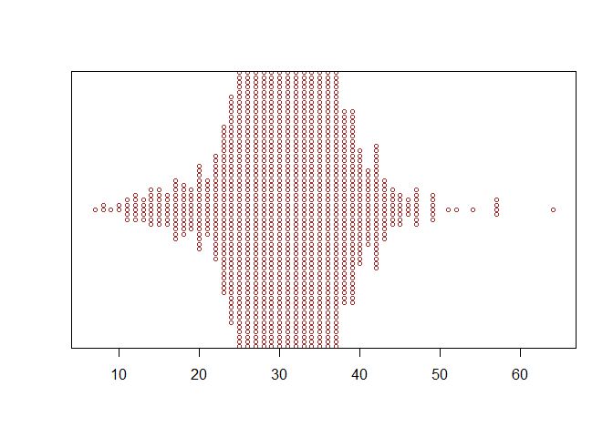

Tidy Tuesday!
================
Kauanoe Greene
2024-12-03

# Libraries

``` r
library(here)
library(tidyverse)
library(beeswarm)
library(hrbrthemes)
library(viridis)
```

# Data

``` r
# Data upload
# straight from github
A64_traffic <- readr::read_csv('https://raw.githubusercontent.com/rfordatascience/tidytuesday/main/data/2024/2024-12-03/A64_traffic.csv')
```

# Data analyses

``` r
# Data analyses  

# check out stat summary
mph <- A64_traffic %>% # dataset  
  mutate(site = `Site Name`) %>% # modify column name
  select(`Avg mph`, `site`, `Time Period Ending`) %>% # focal columns  
  drop_na() %>% # drop the empty cells  
  group_by(`site`) %>% # group primary variable of interest  
  summarise(mean_mph = mean(`Avg mph`, na.rm = TRUE),
            sd_mph = sd(`Avg mph`, na.rm = TRUE)) # calculate mean

# expanded data summary
time_mph <- A64_traffic %>% # data set  
  mutate(site = `Site Name`) %>% # modify column name
  select(`Avg mph`, `site`, `Time Period Ending`) %>% # focal columns  
  drop_na() %>% # drop the empty cells  
  filter(site == "30361338") # only select the data from this site  
```

# Visual

``` r
# data visual  
# trying beeswarm function
# plots individual points
beeswarm(time_mph$`Avg mph`, horizontal = TRUE, # plot the data points of avg mph horizontally
         col = "brown", # modify dot color  
         cex = 0.7) # modify dot size  
```

<!-- -->

``` r
# save csv file to data folder  
write.csv(time_mph, here("Tidy_Tuesday", "Data", "tidydata5.csv"))

# Tidy Tuesday Takeaways:  
# Explored and discovered how to make a plot using the beeswarm function (even though it does not seem very informative in this visual, haha)
# practiced filtering out more data 
# practiced calculating summary stats
# practiced cleaning column names using mutate function
```
