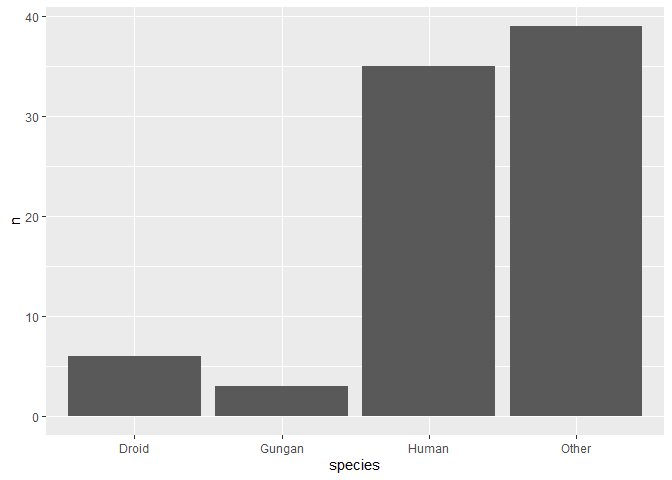
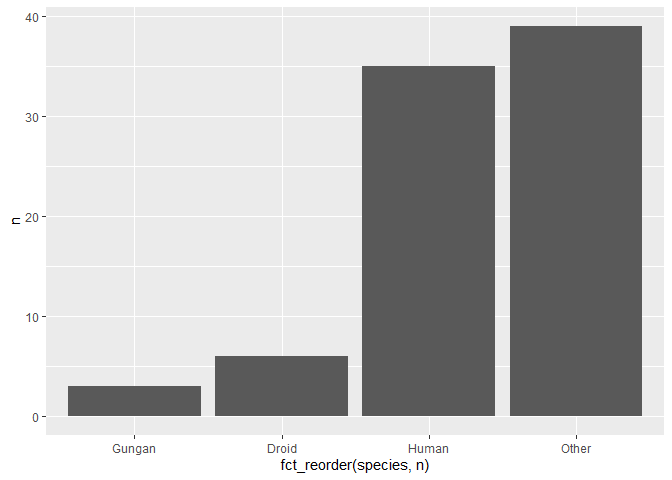
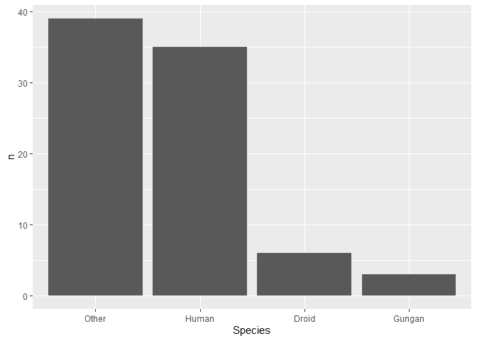
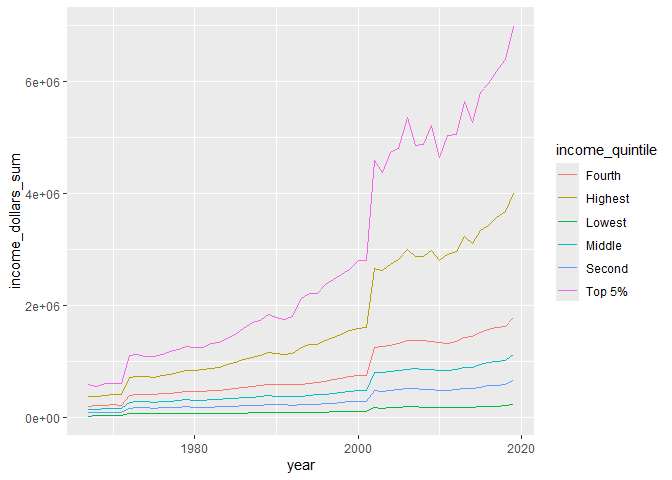
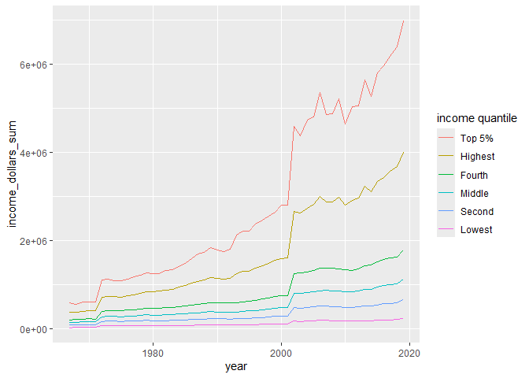
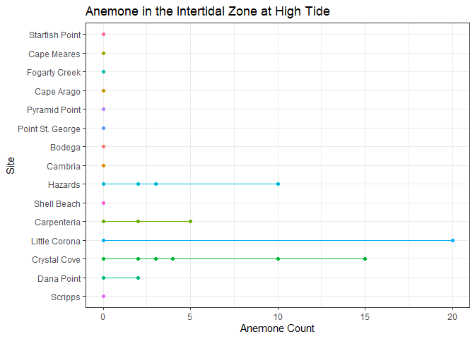

Week 09B: Working with Factors
================
Kauanoe Greene
2024-11-01

- [Libraries](#libraries)
- [Data: 9B Flipped Lecture](#data-9b-flipped-lecture)
- [Intro to Factors](#intro-to-factors)
- [Homework](#homework)
- [Data: 9B Homework](#data-9b-homework)
- [Plot](#plot)

# Libraries

``` r
# Packages
# install.packages("forcats")
# install.packages("janitor")

# Libraries

library(tidyverse)
library(tidytext)
library(here)
library(janitor)
library(viridis)
```

# Data: 9B Flipped Lecture

``` r
# DATA

# Data upload

# tuesdata <- tidytuesdayR::tt_load(2021, week = 7)
# income_mean<-tuesdata$income_mean

income_mean <- readr::read_csv('https://raw.githubusercontent.com/rfordatascience/tidytuesday/master/data/2021/2021-02-09/income_mean.csv')
```

# Intro to Factors

``` r
# FACTORS

# a factor is a specialized version of a character
# How we store categorical data
# Levels: values that a factor take
# Default levels are always alphabetical

fruits <- factor(c("Apple", "Grape", "Banana"))
fruits
```

    ## [1] Apple  Grape  Banana
    ## Levels: Apple Banana Grape

``` r
test <- c("A", "1", "2")
as.numeric(test)
```

    ## [1] NA  1  2

``` r
test <- factor(test) # convert to a factor
as.numeric(test)
```

    ## [1] 3 1 2

``` r
# CSV - reading them in
# read.csv(): string read in as factors
# read_csv(): strings read in as characters
```

``` r
#check out data
glimpse(starwars)
```

    ## Rows: 87
    ## Columns: 14
    ## $ name       <chr> "Luke Skywalker", "C-3PO", "R2-D2", "Darth Vader", "Leia Or…
    ## $ height     <int> 172, 167, 96, 202, 150, 178, 165, 97, 183, 182, 188, 180, 2…
    ## $ mass       <dbl> 77.0, 75.0, 32.0, 136.0, 49.0, 120.0, 75.0, 32.0, 84.0, 77.…
    ## $ hair_color <chr> "blond", NA, NA, "none", "brown", "brown, grey", "brown", N…
    ## $ skin_color <chr> "fair", "gold", "white, blue", "white", "light", "light", "…
    ## $ eye_color  <chr> "blue", "yellow", "red", "yellow", "brown", "blue", "blue",…
    ## $ birth_year <dbl> 19.0, 112.0, 33.0, 41.9, 19.0, 52.0, 47.0, NA, 24.0, 57.0, …
    ## $ sex        <chr> "male", "none", "none", "male", "female", "male", "female",…
    ## $ gender     <chr> "masculine", "masculine", "masculine", "masculine", "femini…
    ## $ homeworld  <chr> "Tatooine", "Tatooine", "Naboo", "Tatooine", "Alderaan", "T…
    ## $ species    <chr> "Human", "Droid", "Droid", "Human", "Human", "Human", "Huma…
    ## $ films      <list> <"A New Hope", "The Empire Strikes Back", "Return of the J…
    ## $ vehicles   <list> <"Snowspeeder", "Imperial Speeder Bike">, <>, <>, <>, "Imp…
    ## $ starships  <list> <"X-wing", "Imperial shuttle">, <>, <>, "TIE Advanced x1",…

``` r
# how many species?
starwars %>% 
  filter(!is.na(species)) %>% # get rid of the NAs
  count(species, sort = TRUE)
```

    ## # A tibble: 37 × 2
    ##    species      n
    ##    <chr>    <int>
    ##  1 Human       35
    ##  2 Droid        6
    ##  3 Gungan       3
    ##  4 Kaminoan     2
    ##  5 Mirialan     2
    ##  6 Twi'lek      2
    ##  7 Wookiee      2
    ##  8 Zabrak       2
    ##  9 Aleena       1
    ## 10 Besalisk     1
    ## # ℹ 27 more rows

``` r
# convert data into a factor and lumps it all together
star_counts<-starwars %>%
  filter(!is.na(species)) %>%
  mutate(species = fct_lump(species, n = 3)) %>%
  count(species)

star_counts
```

    ## # A tibble: 4 × 2
    ##   species     n
    ##   <fct>   <int>
    ## 1 Droid       6
    ## 2 Gungan      3
    ## 3 Human      35
    ## 4 Other      39

``` r
# Reordering factors

star_counts %>%
  ggplot(aes(x = species, y = n))+
  geom_col()
```

<!-- -->

``` r
# reorder in order, lol.

star_counts %>%
  ggplot(aes(x = fct_reorder(species, n), y = n))+ # reorder the factor of species by n
  geom_col()
```

<!-- -->

``` r
# reorder, descending

star_counts %>%
  ggplot(aes(x = fct_reorder(species, n, .desc = TRUE), y = n))+ # reorder the factor of species by n
  geom_col() +
  labs(x = "Species")
```

<!-- -->

``` r
# reorder lineplots
# view data
glimpse(income_mean)
```

    ## Rows: 3,708
    ## Columns: 5
    ## $ year            <dbl> 2019, 2019, 2019, 2019, 2019, 2019, 2018, 2018, 2018, …
    ## $ race            <chr> "All Races", "All Races", "All Races", "All Races", "A…
    ## $ dollar_type     <chr> "Current Dollars", "Current Dollars", "Current Dollars…
    ## $ income_quintile <chr> "Lowest", "Second", "Middle", "Fourth", "Highest", "To…
    ## $ income_dollars  <dbl> 15286, 40652, 68938, 111112, 254449, 451122, 13775, 37…

``` r
# plot total income by year and quantile
# plot across all dollar types

total_income<-income_mean %>%
  group_by(year, income_quintile)%>%
  summarise(income_dollars_sum = sum(income_dollars))%>%
  mutate(income_quintile = factor(income_quintile)) # make it a factor

# plot - basic line plot

total_income%>%
ggplot(aes(x = year, y = income_dollars_sum, color = income_quintile))+
  geom_line()
```

<!-- -->

``` r
# order line plots
# use fct_reorder2
# reorders by two variables

total_income%>%
  ggplot(aes(x = year, y = income_dollars_sum, 
             color = fct_reorder2(income_quintile,year,income_dollars_sum)))+
  geom_line()+
  labs(color = "income quantile")
```

<!-- -->

``` r
# reorder levels in a vector

x1 <- factor(c("Jan", "Mar", "Apr", "Dec"))

x1
```

    ## [1] Jan Mar Apr Dec
    ## Levels: Apr Dec Jan Mar

``` r
# set specific order of the levels

x1 <- factor(c("Jan", "Mar", "Apr", "Dec"), levels = c("Jan", "Mar", "Apr", "Dec"))

x1
```

    ## [1] Jan Mar Apr Dec
    ## Levels: Jan Mar Apr Dec

``` r
# subset data with factors

starwars_clean<-starwars %>% 
  filter(!is.na(species)) %>% # remove the NAs
  count(species, sort = TRUE) %>%
  mutate(species = factor(species)) %>% # make species a factor
  filter(n>3) # only keep species that have more than 3

# view it
starwars_clean
```

    ## # A tibble: 2 × 2
    ##   species     n
    ##   <fct>   <int>
    ## 1 Human      35
    ## 2 Droid       6

``` r
levels(starwars_clean$species)
```

    ##  [1] "Aleena"         "Besalisk"       "Cerean"         "Chagrian"      
    ##  [5] "Clawdite"       "Droid"          "Dug"            "Ewok"          
    ##  [9] "Geonosian"      "Gungan"         "Human"          "Hutt"          
    ## [13] "Iktotchi"       "Kaleesh"        "Kaminoan"       "Kel Dor"       
    ## [17] "Mirialan"       "Mon Calamari"   "Muun"           "Nautolan"      
    ## [21] "Neimodian"      "Pau'an"         "Quermian"       "Rodian"        
    ## [25] "Skakoan"        "Sullustan"      "Tholothian"     "Togruta"       
    ## [29] "Toong"          "Toydarian"      "Trandoshan"     "Twi'lek"       
    ## [33] "Vulptereen"     "Wookiee"        "Xexto"          "Yoda's species"
    ## [37] "Zabrak"

``` r
# recoing levels

starwars_clean<-starwars %>% 
  filter(!is.na(species)) %>% # remove the NAs
  count(species, sort = TRUE) %>%
  mutate(species = factor(species)) %>% # make species a factor 
  filter(n>3)  %>% # only keep species that have more than 3 
  droplevels() # drop extra levels

levels(starwars_clean$species)
```

    ## [1] "Droid" "Human"

``` r
# continue to recode levels

starwars_clean<-starwars %>% 
  filter(!is.na(species)) %>% # remove the NAs
  count(species, sort = TRUE) %>%
  mutate(species = factor(species)) %>% # make species a factor 
  filter(n>3)  %>% # only keep species that have more than 3 
  droplevels() %>% # drop extra levels 
  mutate(species = fct_recode(species, "Humanoid" = "Human"))
starwars_clean
```

    ## # A tibble: 2 × 2
    ##   species      n
    ##   <fct>    <int>
    ## 1 Humanoid    35
    ## 2 Droid        6

# Homework

``` r
# Homework

# Data set: 
# Use either intertidal.csv or intertidal_latitude.csv

# Task 1: Clean data!
# Reorder your factors into orders that make sense!
# Fix the column headers, too!
# Use the Janitor Package

# Task 2: Plot!
# Make any type of plot where one axis is a factor
# If you decide to plot tide height, order it low-high
# If you decide to plot site, order it by latitude (s-n or n-s)
```

# Data: 9B Homework

``` r
# Data upload
# Read in csv
# intertidal dataset
data.tide <-read_csv(here("Week_09", "Data", "intertidaldata.csv"))

view(data.tide) # dataset
glimpse(data.tide) # check it out
```

    ## Rows: 450
    ## Columns: 13
    ## $ Site                  <chr> "Scripps", "Scripps", "Scripps", "Scripps", "Scr…
    ## $ Transect              <dbl> 1, 1, 1, 2, 2, 2, 3, 3, 3, 4, 4, 4, 5, 5, 5, 6, …
    ## $ Quadrat               <chr> "Low  .", "Mid", "High", "Low", "Mid", "High", "…
    ## $ `Bare Rock`           <dbl> 25, 50, 20, 10, 40, 40, 0, 30, 60, 0, 45, 70, 5,…
    ## $ Algae                 <dbl> 75, 0, 50, 85, 5, 5, 100, 5, 4, 100, 10, 0, 70, …
    ## $ Mussels               <dbl> 0, 5, 1, 0, 10, 0, 0, 10, 1, 0, 3, 0, 0, 5, 0, 0…
    ## $ `Small Barnacles`     <dbl> 2, 50, 50, 0, 40, 55, 0, 40, 20, 0, 25, 25, 20, …
    ## $ `Large Barnacles`     <dbl> 5, 5, 0, 0, 1, 0, 1, 0, 0, 0, 15, 5, 5, 0, 0, 5,…
    ## $ `Gooseneck Barnacles` <dbl> 0, 0, 0, 5, 5, 0, 0, 30, 5, 0, 0, 0, 0, 0, 0, 0,…
    ## $ Anemone               <dbl> 3, 0, 0, 0, 0, 0, 0, 0, 0, 0, 5, 0, 0, 10, 0, 0,…
    ## $ `Whelks (Counts)`     <dbl> 0, 0, 0, 0, 0, 0, 0, 0, 1, 0, 0, 0, 0, 1, 0, 0, …
    ## $ `Crabs (Counts)`      <dbl> 0, 0, 0, 0, 0, 0, 0, 0, 0, 0, 0, 0, 0, 0, 0, 0, …
    ## $ `Stars (Counts)`      <dbl> 0, 0, 0, 0, 0, 0, 0, 0, 0, 0, 0, 0, 0, 0, 0, 0, …

``` r
# Data upload
# Read in csv
# intertidal latitude dataset 
data.lat <-read_csv(here("Week_09", "Data", "intertidaldata_latitude.csv"))

view(data.lat) # dataset
glimpse(data.lat) # check it out
```

    ## Rows: 15
    ## Columns: 2
    ## $ Site     <chr> "Starfish Point", "Cape Meares", "Fogarty Creek", "Cape Arago…
    ## $ Latitude <dbl> 47.65110, 45.47201, 44.83672, 43.30366, 41.99113, 41.78296, 3…

``` r
# i want to join both datasets by site
# they both have sites in common

join <- inner_join(data.lat, data.tide) %>% # join the data sets by site
  drop_na() # remove the na's
glimpse(join) # check it out
```

    ## Rows: 450
    ## Columns: 14
    ## $ Site                  <chr> "Starfish Point", "Starfish Point", "Starfish Po…
    ## $ Latitude              <dbl> 47.6511, 47.6511, 47.6511, 47.6511, 47.6511, 47.…
    ## $ Transect              <dbl> 1, 1, 1, 2, 2, 2, 3, 3, 3, 4, 4, 4, 5, 5, 5, 6, …
    ## $ Quadrat               <chr> "Low", "Mid", "High", "Low", "Mid", "High", "Low…
    ## $ `Bare Rock`           <dbl> 0, 0, 3, 30, 10, 15, 0, 10, 5, 30, 2, 10, 15, 20…
    ## $ Algae                 <dbl> 90, 0, 0, 40, 0, 3, 80, 0, 5, 70, 0, 5, 50, 0, 5…
    ## $ Mussels               <dbl> 0, 90, 1, 0, 5, 0, 0, 5, 1, 0, 85, 1, 0, 70, 1, …
    ## $ `Small Barnacles`     <dbl> 0, 75, 95, 0, 2, 85, 20, 30, 95, 0, 50, 90, 0, 6…
    ## $ `Large Barnacles`     <dbl> 0, 5, 0, 0, 5, 0, 0, 5, 0, 0, 5, 0, 0, 5, 0, 0, …
    ## $ `Gooseneck Barnacles` <dbl> 1, 10, 1, 0, 90, 0, 0, 80, 0, 0, 15, 0, 0, 25, 0…
    ## $ Anemone               <dbl> 20, 5, 0, 30, 1, 0, 0, 20, 0, 25, 2, 0, 75, 0, 0…
    ## $ `Whelks (Counts)`     <dbl> 0, 91, 0, 0, 13, 0, 2, 48, 0, 0, 24, 0, 0, 79, 0…
    ## $ `Crabs (Counts)`      <dbl> 0, 0, 0, 0, 0, 0, 0, 0, 0, 0, 0, 0, 0, 0, 0, 0, …
    ## $ `Stars (Counts)`      <dbl> 0, 0, 0, 0, 0, 0, 1, 0, 0, 0, 0, 0, 0, 0, 0, 0, …

``` r
# clean column names and values

join_clean <- clean_names(join) # clean up the column names
glimpse(join_clean) # check it out
```

    ## Rows: 450
    ## Columns: 14
    ## $ site                <chr> "Starfish Point", "Starfish Point", "Starfish Poin…
    ## $ latitude            <dbl> 47.6511, 47.6511, 47.6511, 47.6511, 47.6511, 47.65…
    ## $ transect            <dbl> 1, 1, 1, 2, 2, 2, 3, 3, 3, 4, 4, 4, 5, 5, 5, 6, 6,…
    ## $ quadrat             <chr> "Low", "Mid", "High", "Low", "Mid", "High", "Low",…
    ## $ bare_rock           <dbl> 0, 0, 3, 30, 10, 15, 0, 10, 5, 30, 2, 10, 15, 20, …
    ## $ algae               <dbl> 90, 0, 0, 40, 0, 3, 80, 0, 5, 70, 0, 5, 50, 0, 5, …
    ## $ mussels             <dbl> 0, 90, 1, 0, 5, 0, 0, 5, 1, 0, 85, 1, 0, 70, 1, 0,…
    ## $ small_barnacles     <dbl> 0, 75, 95, 0, 2, 85, 20, 30, 95, 0, 50, 90, 0, 60,…
    ## $ large_barnacles     <dbl> 0, 5, 0, 0, 5, 0, 0, 5, 0, 0, 5, 0, 0, 5, 0, 0, 10…
    ## $ gooseneck_barnacles <dbl> 1, 10, 1, 0, 90, 0, 0, 80, 0, 0, 15, 0, 0, 25, 0, …
    ## $ anemone             <dbl> 20, 5, 0, 30, 1, 0, 0, 20, 0, 25, 2, 0, 75, 0, 0, …
    ## $ whelks_counts       <dbl> 0, 91, 0, 0, 13, 0, 2, 48, 0, 0, 24, 0, 0, 79, 0, …
    ## $ crabs_counts        <dbl> 0, 0, 0, 0, 0, 0, 0, 0, 0, 0, 0, 0, 0, 0, 0, 0, 0,…
    ## $ stars_counts        <dbl> 0, 0, 0, 0, 0, 0, 1, 0, 0, 0, 0, 0, 0, 0, 0, 0, 1,…

``` r
# change characters into factors

join_clean$quadrat <- join_clean$quadrat %>% # focal column: quadrat
  factor(levels = c("Low", "Mid", "High")) %>% # factor levels
  str_replace_all(". [1]", "") # remove unwanted symbols
glimpse(join_clean) # check it out
```

    ## Rows: 450
    ## Columns: 14
    ## $ site                <chr> "Starfish Point", "Starfish Point", "Starfish Poin…
    ## $ latitude            <dbl> 47.6511, 47.6511, 47.6511, 47.6511, 47.6511, 47.65…
    ## $ transect            <dbl> 1, 1, 1, 2, 2, 2, 3, 3, 3, 4, 4, 4, 5, 5, 5, 6, 6,…
    ## $ quadrat             <chr> "Low", "Mid", "High", "Low", "Mid", "High", "Low",…
    ## $ bare_rock           <dbl> 0, 0, 3, 30, 10, 15, 0, 10, 5, 30, 2, 10, 15, 20, …
    ## $ algae               <dbl> 90, 0, 0, 40, 0, 3, 80, 0, 5, 70, 0, 5, 50, 0, 5, …
    ## $ mussels             <dbl> 0, 90, 1, 0, 5, 0, 0, 5, 1, 0, 85, 1, 0, 70, 1, 0,…
    ## $ small_barnacles     <dbl> 0, 75, 95, 0, 2, 85, 20, 30, 95, 0, 50, 90, 0, 60,…
    ## $ large_barnacles     <dbl> 0, 5, 0, 0, 5, 0, 0, 5, 0, 0, 5, 0, 0, 5, 0, 0, 10…
    ## $ gooseneck_barnacles <dbl> 1, 10, 1, 0, 90, 0, 0, 80, 0, 0, 15, 0, 0, 25, 0, …
    ## $ anemone             <dbl> 20, 5, 0, 30, 1, 0, 0, 20, 0, 25, 2, 0, 75, 0, 0, …
    ## $ whelks_counts       <dbl> 0, 91, 0, 0, 13, 0, 2, 48, 0, 0, 24, 0, 0, 79, 0, …
    ## $ crabs_counts        <dbl> 0, 0, 0, 0, 0, 0, 0, 0, 0, 0, 0, 0, 0, 0, 0, 0, 0,…
    ## $ stars_counts        <dbl> 0, 0, 0, 0, 0, 0, 1, 0, 0, 0, 0, 0, 0, 0, 0, 0, 1,…

``` r
# convert characters to factors!

join_clean %>% # data set
  mutate(site = fct_lump(site)) %>% # an attempt to make site characters into factors
  mutate(quadrat = fct_lump(quadrat)) # an attempt to make quadrat characters into factors
```

    ## # A tibble: 450 × 14
    ##    site        latitude transect quadrat bare_rock algae mussels small_barnacles
    ##    <fct>          <dbl>    <dbl> <fct>       <dbl> <dbl>   <dbl>           <dbl>
    ##  1 Starfish P…     47.7        1 Low             0    90       0               0
    ##  2 Starfish P…     47.7        1 Mid             0     0      90              75
    ##  3 Starfish P…     47.7        1 High            3     0       1              95
    ##  4 Starfish P…     47.7        2 Low            30    40       0               0
    ##  5 Starfish P…     47.7        2 Mid            10     0       5               2
    ##  6 Starfish P…     47.7        2 High           15     3       0              85
    ##  7 Starfish P…     47.7        3 Low             0    80       0              20
    ##  8 Starfish P…     47.7        3 Mid            10     0       5              30
    ##  9 Starfish P…     47.7        3 High            5     5       1              95
    ## 10 Starfish P…     47.7        4 Low            30    70       0               0
    ## # ℹ 440 more rows
    ## # ℹ 6 more variables: large_barnacles <dbl>, gooseneck_barnacles <dbl>,
    ## #   anemone <dbl>, whelks_counts <dbl>, crabs_counts <dbl>, stars_counts <dbl>

# Plot

``` r
# plot!
# include a factor on one axis
# make sure the values are organized alphabetically/chronologically

anemoneplot <- join_clean %>% # data set
  select(site, quadrat, anemone, latitude) %>% # focal columns
  filter(quadrat == "High") %>% # focal quadrat
  ggplot(aes(x = anemone, # x axis value
             y = fct_reorder(site, latitude), # y axis value and organize by latitude (tried plotting on x axis but it got smooshed)
             color = site)) + # color the different sites
  geom_line() + # plot type
  geom_point() + # plot point
  labs(x = "Anemone Count", # x axis title
       y = "Site", # y axis title 
       title = "Anemone in the Intertidal Zone at High Tide") + # plot title
  theme_bw() + # theme
  theme(legend.position = "none")  # remove legend

# save plot to my output folder
ggsave(here("Week_09", "Output", "anemoneplot.png")) 

# view plot
anemoneplot
```

<!-- -->
